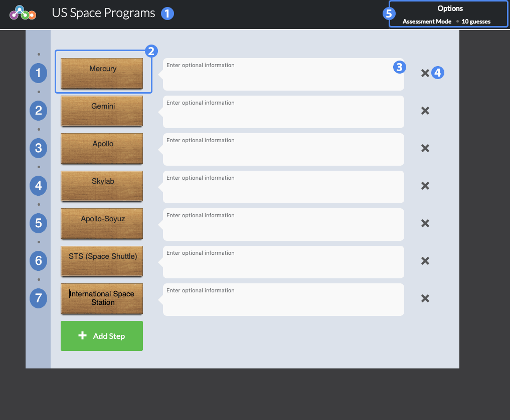

# Sequencer #
Students are given a jumbled set of words or phrases and are tasked with placing them in the correct sequential order.

## Overview ##

1. Title of the widget
2. Sequence Tile
3. Optional information about the tile
4. Delete this tile row
5. Widget options

## Details ##

The ordering of tiles in the Creator dictates the correct sequence for students to be given a 100% score. Tiles can be given additional explanatory information in the "optional information" box. This will be displayed when the tile is selected by the student in the Player.

### Sequencer Options ###

Selections the **Options** menu on the top-right opens the options dialog. In **Assessment** mode, students are given a fixed number of attempts to guess the correct sequence. Students are not informed of the correct sequence when a guess is submitted, though they will be informed how many tiles are ordered correctly. If the student chooses to end the widget, or runs out of guesses, the highest guess percentage is used as their final score. In **Practice** mode, students are granted an unlimited number of attempts to guess the correct sequence. Upon submitting the correct sequence, they are given a 100% score.

Use the **Number of Guesses** input box to determine how many guesses students are given in Assessment mode.