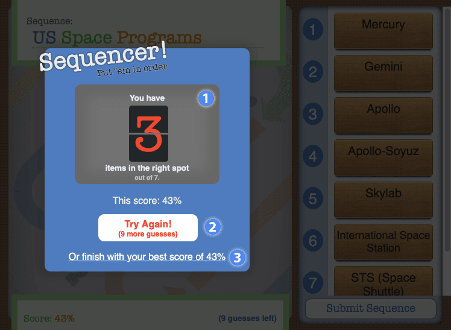

# Overview #
Students are given a jumbled set of words or phrases and are tasked with placing them in the correct sequential order.

1. Pile of unordered tiles
2. Tiles placed in sequence
3. Highest score received
4. Number of guesses remaining

1. Number of correctly ordered tiles
2. Try again button, with remaining submission count
3. Complete the widget with the current high score

## Details ##

### Sorting ###

Drag tiles from the game board to the **Sequence list area** in the correct order. Tiles with a speech bubble icon have a **description** which appears when you mouse over the tile.

### Submitting ###

When you've ordered the tiles to your liking click on the **Submit Sequence** button. This will show you how many items you have in the right sequence. You can continue submitting sequences until you receive a 100% score or run out of guesses. The remaining guess count is displayed under the **Try Again** button. You can always complete the widget early, which will give you a score based on your highest scoring submission.